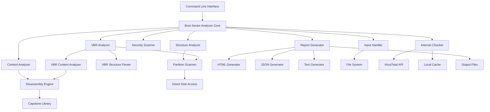

# Design Document: Boot Sector Analyzer v0.3.0

## Overview

The Boot Sector Analyzer is a Python console application that performs comprehensive analysis of boot sectors from disk drives or boot sector image files. The system follows a modular architecture with distinct components for structure analysis, content analysis, security scanning, and threat intelligence gathering.

**Version 0.3.0** represents the enhanced release with complete functionality for boot sector analysis, security threat detection, comprehensive reporting capabilities, advanced hexdump functionality for manual review, boot code disassembly with assembly syntax highlighting, HTML report generation with interactive elements and responsive design, individual partition color coding, improved HTML styling for better readability and professional presentation, and **Volume Boot Record (VBR) detection and analysis** for comprehensive partition-level security assessment.

The application uses Python's built-in `struct` module for binary parsing, integrates with the VirusTotal API for threat intelligence, includes a disassembly engine for x86/x86-64 boot code analysis, provides human-readable, JSON, and HTML output formats for analysis results, and now includes **VBR analysis capabilities** that automatically detect valid partitions and extract Volume Boot Records for filesystem-specific security analysis.

## Architecture

The system follows a layered architecture with clear separation of concerns:



### Component Responsibilities

- **CLI Layer**: Argument parsing, user interaction, and output formatting
- **Core Engine**: Orchestrates analysis workflow and coordinates components
- **Input Handler**: Reads boot sectors from devices or image files
- **Structure Analyzer**: Parses MBR structure and validates boot sector format
- **Content Analyzer**: Examines boot code content, calculates hashes, and performs disassembly
- **Disassembly Engine**: Converts boot code machine instructions to assembly language
- **Security Scanner**: Detects known threats and suspicious patterns
- **Internet Checker**: Queries online threat intelligence sources
- **Report Generator**: Creates structured analysis reports in multiple formats (human, JSON, HTML)
- **HTML Generator**: Creates self-contained HTML reports with embedded CSS and syntax highlighting
- **VBR Analyzer**: Orchestrates Volume Boot Record detection, extraction, and analysis
- **Partition Scanner**: Identifies valid partitions from MBR analysis and extracts VBR data from disk
- **VBR Structure Parser**: Parses filesystem-specific VBR structures (FAT, NTFS, exFAT)
- **VBR Content Analyzer**: Analyzes VBR boot code content, patterns, and security threats

## Components and Interfaces

### Input Handler

```python
class InputHandler:
    def read_boot_sector(self, source: str) -> bytes:
        """Read 512 bytes from device or file"""
        
    def validate_boot_sector(self, data: bytes) -> bool:
        """Validate boot sector size and basic structure"""
```

**Responsibilities:**
- Read boot sector data from disk devices or image files
- Validate input data size (exactly 512 bytes)
- Handle file I/O errors and permission issues
- Support both raw device access and image file reading

### Structure Analyzer

```python
class StructureAnalyzer:
    def parse_mbr(self, boot_sector: bytes) -> MBRStructure:
        """Parse Master Boot Record structure"""
        
    def validate_boot_signature(self, boot_sector: bytes) -> bool:
        """Check for valid boot signature (0x55AA)"""
        
    def parse_partition_table(self, boot_sector: bytes) -> List[PartitionEntry]:
        """Extract and validate partition table entries"""
        
    def detect_anomalies(self, mbr: MBRStructure) -> List[Anomaly]:
        """Identify structural anomalies"""
```

**Key Features:**
- Uses Python `struct` module for binary parsing
- Parses MBR according to standard 512-byte layout:
  - Bytes 0-445: Bootstrap code area
  - Bytes 446-509: Partition table (4 entries × 16 bytes each)
  - Bytes 510-511: Boot signature (0x55AA)
- Validates partition table consistency
- Detects overlapping partitions and invalid entries

### Content Analyzer

```python
class ContentAnalyzer:
    def calculate_hashes(self, boot_code: bytes) -> Dict[str, str]:
        """Calculate MD5, SHA-256 hashes of boot code"""
        
    def detect_suspicious_patterns(self, boot_code: bytes) -> List[Pattern]:
        """Identify suspicious instruction patterns"""
        
    def extract_strings(self, boot_code: bytes) -> List[str]:
        """Extract readable strings and URLs"""
        
    def analyze_entropy(self, boot_code: bytes) -> float:
        """Calculate entropy to detect encryption/obfuscation"""
        
    def disassemble_boot_code(self, boot_code: bytes) -> DisassemblyResult:
        """Disassemble x86/x86-64 assembly instructions from boot code"""
        
    def identify_boot_patterns(self, instructions: List[Instruction]) -> List[BootPattern]:
        """Identify common boot sector patterns and operations"""
```

**Analysis Techniques:**
- Cryptographic hash calculation (MD5, SHA-256)
- String extraction using regular expressions
- Entropy analysis to detect packed/encrypted code
- Pattern matching for suspicious instruction sequences
- Detection of embedded URLs or IP addresses
- x86/x86-64 disassembly using Capstone engine
- Boot sector pattern recognition (INT 13h, INT 10h, jump instructions)

### Disassembly Engine

```python
class DisassemblyEngine:
    def __init__(self):
        """Initialize Capstone disassembly engine for x86 architecture"""
        
    def disassemble_16bit(self, code: bytes, base_address: int = 0x7C00) -> List[Instruction]:
        """Disassemble 16-bit x86 code (typical for boot sectors)"""
        
    def disassemble_32bit(self, code: bytes, base_address: int = 0x7C00) -> List[Instruction]:
        """Disassemble 32-bit x86 code"""
        
    def format_instruction(self, instruction: Instruction) -> FormattedInstruction:
        """Format instruction with address, bytes, and mnemonic"""
        
    def add_comments(self, instruction: Instruction) -> str:
        """Add explanatory comments for common boot sector operations"""
```

**Disassembly Features:**
- Uses Capstone disassembly framework for accurate x86/x86-64 decoding
- Supports both 16-bit and 32-bit instruction modes
- Handles invalid instructions gracefully by displaying as raw hex
- Provides instruction addresses, opcodes, and mnemonics
- Adds contextual comments for common boot sector operations
- Identifies jump targets and control flow patterns

### Security Scanner

```python
class SecurityScanner:
    def check_known_signatures(self, hashes: Dict[str, str]) -> List[ThreatMatch]:
        """Check hashes against known malware signatures"""
        
    def detect_bootkit_patterns(self, boot_code: bytes) -> List[BootkitIndicator]:
        """Identify common bootkit signatures"""
        
    def assess_threat_level(self, findings: List[Finding]) -> ThreatLevel:
        """Classify overall threat level"""
```

**Detection Capabilities:**
- Known malware hash matching
- Bootkit signature detection
- MBR hijacking indicators
- Suspicious code patterns
- Threat level classification (LOW, MEDIUM, HIGH, CRITICAL)

### Internet Checker

```python
class InternetChecker:
    def query_virustotal(self, file_hash: str) -> VirusTotalResult:
        """Query VirusTotal API for threat intelligence"""
        
    def query_virustotal_boot_code(self, boot_code: bytes) -> Optional[VirusTotalResult]:
        """Query VirusTotal API specifically for boot code region (446 bytes)"""
        
    def should_skip_virustotal(self, boot_code: bytes) -> bool:
        """Check if boot code is empty (all zeros) and should skip VirusTotal analysis"""
        
    def cache_results(self, hash_value: str, result: dict) -> None:
        """Cache API results locally"""
        
    def handle_rate_limits(self) -> None:
        """Implement API rate limiting"""
```

**Integration Features:**
- VirusTotal API v3 integration using official `vt-py` library
- Local caching to minimize API calls
- Rate limiting compliance
- Graceful degradation when offline
- SSL certificate validation
- **Enhanced boot code analysis**: Submit only the boot code region (first 446 bytes) for targeted malware detection
- **Empty boot code detection**: Skip VirusTotal submission when boot code contains only zero bytes
- **Complete response inclusion**: Include full VirusTotal response data in reports for comprehensive threat intelligence

### Report Generator

```python
class ReportGenerator:
    def generate_report(self, analysis_result: AnalysisResult, format: str) -> str:
        """Generate analysis report in specified format (human, json, html)"""
        
    def generate_hexdump(self, boot_sector: bytes) -> str:
        """Generate hexdump representation of boot sector"""
        
    def format_hexdump_table(self, boot_sector: bytes) -> List[str]:
        """Format hexdump as 17-column table with offset and hex bytes"""
        
    def format_ascii_column(self, data: bytes) -> str:
        """Format ASCII representation with dots for non-printable characters"""
        
    def generate_html_report(self, analysis_result: AnalysisResult) -> str:
        """Generate self-contained HTML report with embedded CSS"""
        
    def format_assembly_html(self, disassembly: DisassemblyResult) -> str:
        """Format disassembled code with syntax highlighting for HTML"""
```

**Hexdump Features:**
- 17-column table format: offset (1 column) + 16 hex bytes (16 columns)
- Zero-padded uppercase hex offsets (0x0000, 0x0010, 0x0020, etc.)
- Hex bytes displayed with proper spacing (e.g., "48 65 6C 6C 6F")
- ASCII representation column showing printable characters
- Non-printable bytes displayed as dots (.) in ASCII column
- Support for human-readable, JSON, and HTML output formats
- Complete 512-byte boot sector coverage (32 rows × 16 bytes)
- MBR section color coding in HTML format

**Report Generation:**
- Structured analysis reports with all findings
- Integration of hexdump section for manual review
- Support for multiple output formats (human-readable, JSON, HTML)
- Critical finding highlighting and threat level indication
- Assembly code disassembly with syntax highlighting
- Interactive HTML elements for enhanced user experience

### HTML Generator

```python
class HTMLGenerator:
    def create_html_document(self, analysis_result: AnalysisResult) -> str:
        """Create complete HTML document with DOCTYPE and metadata"""
        
    def embed_css_styles(self) -> str:
        """Generate embedded CSS for styling and responsive design"""
        
    def format_threat_level_badge(self, threat_level: ThreatLevel) -> str:
        """Create color-coded threat level badge"""
        
    def format_assembly_syntax_highlighting(self, instructions: List[Instruction]) -> str:
        """Apply syntax highlighting to assembly code"""
        
    def create_table_of_contents(self, sections: List[str]) -> str:
        """Generate table of contents with anchor links"""
        
    def format_hexdump_with_colors(self, boot_sector: bytes) -> str:
        """Create color-coded hexdump table for MBR sections"""
```

**HTML Features:**
- Self-contained HTML documents with embedded CSS
- Responsive design for different screen sizes
- Color-coded threat level badges (green/yellow/red/dark red)
- Syntax highlighting for assembly code (blue instructions, green registers, orange values, red addresses)
- Interactive table of contents with anchor navigation
- Monospace formatting for code and hex data
- Professional styling with proper typography
- MBR section highlighting in hexdump display
- Copyable hash values and technical data

### VBR Analyzer

```python
class VBRAnalyzer:
    def __init__(self, partition_scanner: PartitionScanner, vbr_structure_parser: VBRStructureParser, 
                 vbr_content_analyzer: VBRContentAnalyzer):
        """Initialize VBR analysis components"""
        
    def analyze_vbrs(self, source: str, mbr_structure: MBRStructure) -> List[VBRAnalysisResult]:
        """Analyze VBRs from all valid partitions"""
        
    def should_extract_vbrs(self, source: str) -> bool:
        """Determine if VBR extraction should be performed (only for direct disk access)"""
        
    def extract_partition_vbrs(self, source: str, partitions: List[PartitionEntry]) -> List[VBRData]:
        """Extract VBR data from valid partitions"""
```

**Responsibilities:**
- Orchestrate VBR detection and analysis workflow
- Coordinate between partition scanning, VBR extraction, and analysis
- Determine when VBR extraction is appropriate (disk vs image file)
- Handle errors during VBR extraction and continue with remaining partitions

### Partition Scanner

```python
class PartitionScanner:
    def identify_valid_partitions(self, mbr_structure: MBRStructure) -> List[ValidPartition]:
        """Identify valid, non-empty partitions from MBR analysis"""
        
    def extract_vbr_data(self, device_path: str, partition: PartitionEntry) -> Optional[bytes]:
        """Extract 512 bytes from partition's first sector"""
        
    def calculate_partition_offset(self, partition: PartitionEntry) -> int:
        """Calculate byte offset for partition's first sector"""
        
    def validate_partition_access(self, device_path: str, partition: PartitionEntry) -> bool:
        """Validate that partition can be accessed for VBR extraction"""
```

**Key Features:**
- Identifies valid partitions from MBR partition table
- Calculates LBA-to-byte offset conversion for partition access
- Performs direct disk I/O to extract VBR data
- Handles I/O errors gracefully and continues with remaining partitions
- Validates partition boundaries and accessibility

### VBR Structure Parser

```python
class VBRStructureParser:
    def parse_vbr_structure(self, vbr_data: bytes, partition_type: int) -> VBRStructure:
        """Parse VBR structure based on filesystem type"""
        
    def parse_fat_vbr(self, vbr_data: bytes) -> FATVBRStructure:
        """Parse FAT12/16/32 VBR structure"""
        
    def parse_ntfs_vbr(self, vbr_data: bytes) -> NTFSVBRStructure:
        """Parse NTFS VBR structure"""
        
    def parse_exfat_vbr(self, vbr_data: bytes) -> ExFATVBRStructure:
        """Parse exFAT VBR structure"""
        
    def detect_filesystem_type(self, vbr_data: bytes, partition_type: int) -> FilesystemType:
        """Detect filesystem type from VBR signature and partition type"""
        
    def extract_vbr_boot_code(self, vbr_structure: VBRStructure) -> bytes:
        """Extract boot code region from VBR (varies by filesystem)"""
```

**Parsing Capabilities:**
- Filesystem-specific VBR structure parsing
- FAT12/16/32 VBR parsing with BPB (BIOS Parameter Block)
- NTFS VBR parsing with NTFS-specific metadata
- exFAT VBR parsing with exFAT boot sector structure
- Generic VBR parsing for unknown filesystem types
- Boot code region extraction (varies by filesystem type)

### VBR Content Analyzer

```python
class VBRContentAnalyzer:
    def analyze_vbr_content(self, vbr_structure: VBRStructure) -> VBRContentAnalysis:
        """Perform comprehensive VBR content analysis"""
        
    def calculate_vbr_hashes(self, vbr_data: bytes) -> Dict[str, str]:
        """Calculate MD5 and SHA-256 hashes of VBR data"""
        
    def disassemble_vbr_boot_code(self, boot_code: bytes, filesystem_type: FilesystemType) -> DisassemblyResult:
        """Disassemble VBR boot code with filesystem-specific context"""
        
    def detect_vbr_patterns(self, vbr_structure: VBRStructure) -> List[VBRPattern]:
        """Detect filesystem-specific boot patterns"""
        
    def identify_vbr_anomalies(self, vbr_structure: VBRStructure) -> List[VBRAnomalyy]:
        """Identify suspicious VBR modifications or anomalies"""
        
    def extract_filesystem_metadata(self, vbr_structure: VBRStructure) -> FilesystemMetadata:
        """Extract filesystem-specific metadata (cluster size, volume label, etc.)"""
```

**Analysis Features:**
- VBR-specific hash calculation and comparison
- Filesystem-aware boot code disassembly
- Detection of common VBR boot patterns (FAT boot code, NTFS boot code)
- Identification of VBR modifications and anomalies
- Extraction of filesystem metadata for analysis
- Integration with existing security scanning capabilities

### Individual Partition Color Coding

The system will enhance the existing MBR section color coding to provide distinct colors for each of the 4 partition table entries, improving visual analysis of partition layouts.

```python
class PartitionColors:
    """Color scheme for individual partition entries."""
    PARTITION_1 = "#FFE6E6"  # Light red
    PARTITION_2 = "#E6F3FF"  # Light blue  
    PARTITION_3 = "#E6FFE6"  # Light green
    PARTITION_4 = "#FFF0E6"  # Light orange
    EMPTY_PARTITION = "#F5F5F5"  # Light gray
    
    # ANSI colors for terminal output
    ANSI_PARTITION_1 = ANSIColors.RED
    ANSI_PARTITION_2 = ANSIColors.BLUE
    ANSI_PARTITION_3 = ANSIColors.GREEN
    ANSI_PARTITION_4 = ANSIColors.YELLOW
    ANSI_EMPTY = ANSIColors.WHITE

class MBRDecoder:
    def get_partition_section_type(self, offset: int) -> Tuple[MBRSection, int]:
        """
        Determine which partition entry a byte offset belongs to.
        
        Args:
            offset: Byte offset within the 512-byte MBR
            
        Returns:
            Tuple of (MBR section type, partition number 1-4)
        """
        if 446 <= offset <= 509:
            # Calculate which partition entry (0-3, return as 1-4)
            partition_offset = offset - 446
            partition_number = (partition_offset // 16) + 1
            return (MBRSection.PARTITION_TABLE, partition_number)
        else:
            return (self.get_section_type(offset), 0)
```

**Color Assignment Strategy:**
- **Partition 1 (0x01BE-0x01CD)**: Light red background in HTML, red ANSI in terminal
- **Partition 2 (0x01CE-0x01DD)**: Light blue background in HTML, blue ANSI in terminal  
- **Partition 3 (0x01DE-0x01ED)**: Light green background in HTML, green ANSI in terminal
- **Partition 4 (0x01EE-0x01FD)**: Light orange background in HTML, yellow ANSI in terminal
- **Empty Partitions**: Light gray background, white ANSI for unused entries

**Implementation Approach:**
1. Extend `MBRDecoder.get_section_type()` to return partition-specific information
2. Update `ReportGenerator.format_hexdump_table()` to apply partition-specific colors
3. Update `HTMLGenerator` CSS classes for individual partition styling
4. Add color legend generation for all output formats
5. Ensure color consistency across human-readable, JSON metadata, and HTML formats

### HTML Generator Updates

```python
class HTMLGenerator:
    def get_partition_css_class(self, offset: int) -> str:
        """Get CSS class for partition-specific styling."""
        if 446 <= offset <= 509:
            partition_offset = offset - 446
            partition_number = (partition_offset // 16) + 1
            return f"mbr-partition-{partition_number}"
        else:
            return self.get_mbr_css_class(offset)
    
    def generate_partition_legend(self, mbr_structure: MBRStructure) -> str:
        """Generate HTML legend for partition colors."""
        legend_items = []
        for i, partition in enumerate(mbr_structure.partition_entries, 1):
            status = "Empty" if partition.is_empty else f"Type 0x{partition.system_id:02X}"
            legend_items.append(
                f'<li><span class="mbr-partition-{i}" style="padding: 2px 8px; margin-right: 10px;">■</span> '
                f'Partition {i}: {status}</li>'
            )
        return f'<ul>{"".join(legend_items)}</ul>'
```

**CSS Styling:**
```css
.mbr-partition-1 { background-color: #FFE6E6 !important; } /* Light red */
.mbr-partition-2 { background-color: #E6F3FF !important; } /* Light blue */
.mbr-partition-3 { background-color: #E6FFE6 !important; } /* Light green */
.mbr-partition-4 { background-color: #FFF0E6 !important; } /* Light orange */
.mbr-partition-empty { background-color: #F5F5F5 !important; } /* Light gray */
```

### HTML Styling Improvements

The system will enhance the existing HTML report generation with improved styling for better readability and professional presentation, addressing specific usability issues with assembly code display and hexdump table formatting.

```python
class HTMLStylingEnhancements:
    """Enhanced styling configuration for HTML reports."""
    
    # Light background color scheme for assembly code
    ASSEMBLY_BACKGROUND = "#f8f9fa"  # Light gray background
    ASSEMBLY_TEXT_COLOR = "#212529"  # Dark text for contrast
    
    # Professional color scheme for syntax highlighting
    INSTRUCTION_COLOR = "#0066cc"    # Professional blue
    REGISTER_COLOR = "#228b22"       # Forest green  
    IMMEDIATE_COLOR = "#d2691e"      # Chocolate orange
    ADDRESS_COLOR = "#dc143c"        # Crimson red
    COMMENT_COLOR = "#6a737d"        # Muted gray
    
    # Fixed-width column specifications
    HEXDUMP_OFFSET_WIDTH = "80px"    # Fixed width for offset column
    HEXDUMP_BYTE_WIDTH = "30px"      # Fixed width for each hex byte column
    
    @staticmethod
    def generate_enhanced_css() -> str:
        """Generate enhanced CSS with improved styling."""
        return """
        /* Enhanced assembly code styling */
        .assembly-code {
            font-family: 'Consolas', 'Monaco', 'Courier New', monospace;
            background-color: #f8f9fa;
            color: #212529;
            padding: 20px;
            border-radius: 5px;
            border: 1px solid #dee2e6;
            overflow-x: auto;
            line-height: 1.4;
        }
        
        /* Professional syntax highlighting */
        .asm-instruction { color: #0066cc; font-weight: 500; }
        .asm-register { color: #228b22; }
        .asm-immediate { color: #d2691e; }
        .asm-address { color: #dc143c; }
        .asm-comment { color: #6a737d; font-style: italic; }
        
        /* Fixed-width hexdump table */
        .hexdump-table {
            font-family: 'Consolas', 'Monaco', 'Courier New', monospace;
            border-collapse: collapse;
            width: 100%;
            font-size: 0.85em;
            background-color: #fff;
            table-layout: fixed;
        }
        
        .hexdump-table .offset {
            width: 80px;
            background-color: #f8f9fa;
            font-weight: bold;
            text-align: right;
            padding: 4px 8px;
        }
        
        .hexdump-table td:not(.offset):not(.ascii) {
            width: 30px;
            text-align: center;
            padding: 4px 2px;
        }
        
        .hexdump-table .ascii {
            width: 120px;
            text-align: left;
            background-color: #f8f9fa;
            padding: 4px 8px;
        }
        """

class ContentAnalyzer:
    def check_empty_boot_code(self, boot_code: bytes) -> bool:
        """Check if boot code region contains only zero bytes."""
        return all(byte == 0 for byte in boot_code[:446])
    
    def disassemble_boot_code(self, boot_code: bytes) -> Optional[DisassemblyResult]:
        """
        Disassemble x86/x86-64 assembly instructions from boot code.
        
        Returns None if boot code is empty (all zeros).
        """
        if self.check_empty_boot_code(boot_code):
            return None  # Skip disassembly for empty boot code
            
        # Proceed with normal disassembly...
        return self.disassembly_engine.disassemble(boot_code[:446])

class HTMLGenerator:
    def format_assembly_syntax_highlighting(self, disassembly: Optional[DisassemblyResult]) -> str:
        """
        Apply enhanced syntax highlighting to assembly code with light background.
        
        Args:
            disassembly: Disassembly results to format, or None if no boot code
            
        Returns:
            HTML with enhanced syntax-highlighted assembly code or empty boot code message
        """
        if disassembly is None:
            return '<div class="assembly-code"><p><em>No boot code present (all zeros)</em></p></div>'
        
        if not disassembly.instructions:
            return '<div class="assembly-code"><p><em>No assembly instructions available</em></p></div>'
        
        # Apply enhanced styling with light background and professional colors
        html_lines = []
        for instruction in disassembly.instructions:
            # Format with enhanced color scheme
            addr_html = f'<span class="asm-address">{instruction.address:04X}</span>'
            bytes_str = ' '.join(f'{b:02X}' for b in instruction.bytes)
            bytes_html = f'<span class="monospace">{bytes_str:12}</span>'
            mnemonic_html = f'<span class="asm-instruction">{instruction.mnemonic}</span>'
            operands_html = self._highlight_operands_enhanced(instruction.operands)
            
            comment_html = ""
            if instruction.comment:
                comment_html = f' <span class="asm-comment">; {html_escape(instruction.comment)}</span>'
            
            line = f'{addr_html}:  {bytes_html}  {mnemonic_html} {operands_html}{comment_html}'
            html_lines.append(line)
        
        return f'<div class="assembly-code">{"<br>".join(html_lines)}</div>'
    
    def format_hexdump_with_fixed_columns(self, boot_sector: bytes, mbr_structure=None) -> str:
        """
        Create hexdump table with fixed-width columns for consistent alignment.
        
        Args:
            boot_sector: 512-byte boot sector data
            mbr_structure: Optional MBR structure for partition-specific coloring
            
        Returns:
            HTML table with fixed-width columns and enhanced formatting
        """
        if len(boot_sector) != 512:
            return '<p class="error">Invalid boot sector size</p>'
        
        # Create table with fixed-width styling
        html_lines = ['<table class="hexdump-table">']
        
        # Header row with fixed widths
        header_cells = ['<th class="offset">Offset</th>']
        for i in range(16):
            header_cells.append(f'<th style="width: 30px;">{i:02X}</th>')
        header_cells.append('<th class="ascii">ASCII</th>')
        html_lines.append(f'<tr>{"".join(header_cells)}</tr>')
        
        # Data rows with consistent column widths
        for offset in range(0, len(boot_sector), 16):
            row_data = boot_sector[offset:offset + 16]
            
            # Fixed-width offset cell
            cells = [f'<td class="offset">{offset:04X}</td>']
            
            # Fixed-width hex byte cells
            for i, byte_val in enumerate(row_data):
                byte_offset = offset + i
                css_class = self._get_mbr_section_class(byte_offset, mbr_structure)
                cells.append(f'<td class="{css_class}">{byte_val:02X}</td>')
            
            # Pad incomplete rows
            for i in range(len(row_data), 16):
                cells.append('<td></td>')
            
            # Fixed-width ASCII cell
            ascii_repr = ''.join(
                chr(b) if 32 <= b <= 126 else '.' for b in row_data
            )
            cells.append(f'<td class="ascii">{html_escape(ascii_repr)}</td>')
            
            html_lines.append(f'<tr>{"".join(cells)}</tr>')
        
        html_lines.append('</table>')
        
        # Add enhanced legend
        legend = self._generate_enhanced_hexdump_legend(mbr_structure)
        
        return ''.join(html_lines) + legend
```

**Key Styling Improvements:**

1. **Light Background for Assembly Code**:
   - Changed from dark theme (#1e1e1e) to light background (#f8f9fa)
   - Updated text color to dark (#212529) for better contrast
   - Added subtle border and improved padding

2. **Professional Color Scheme**:
   - Instructions: Professional blue (#0066cc) with medium font weight
   - Registers: Forest green (#228b22) for better readability
   - Immediate values: Chocolate orange (#d2691e) for warmth
   - Memory addresses: Crimson red (#dc143c) for attention
   - Comments: Muted gray (#6a737d) to reduce visual noise

3. **Fixed-Width Hexdump Columns**:
   - Offset column: Fixed 80px width for consistency
   - Hex byte columns: Fixed 30px width each for uniform spacing
   - ASCII column: Fixed 120px width for proper alignment
   - Table layout: Fixed to prevent column width variations

4. **Empty Boot Code Handling**:
   - Check for all-zero boot code before disassembly
   - Display "No boot code present" message instead of attempting disassembly
   - Graceful handling prevents unnecessary processing and confusing output

**Implementation Strategy:**
1. Update `HTMLGenerator.embed_css_styles()` with enhanced CSS
2. Modify `format_assembly_syntax_highlighting()` for light background theme
3. Update `format_hexdump_with_colors()` to use fixed-width columns
4. Add `check_empty_boot_code()` method to `ContentAnalyzer`
5. Update disassembly logic to skip empty boot code regions
6. Ensure backward compatibility with existing HTML reports

## Data Models

### MBR Structure

```python
@dataclass
class MBRStructure:
    bootstrap_code: bytes  # First 446 bytes
    partition_table: List[PartitionEntry]  # 4 entries
    boot_signature: int  # 0x55AA
    disk_signature: Optional[int]  # Optional 4-byte signature at offset 440
    
@dataclass
class PartitionEntry:
    status: int  # Boot indicator (0x80 = bootable, 0x00 = inactive)
    start_chs: Tuple[int, int, int]  # Start CHS address
    partition_type: int  # Partition type code
    end_chs: Tuple[int, int, int]  # End CHS address
    start_lba: int  # Start LBA address
    size_sectors: int  # Size in sectors
```

### Disassembly Models

```python
@dataclass
class DisassemblyResult:
    instructions: List[Instruction]
    total_bytes_disassembled: int
    invalid_instructions: List[InvalidInstruction]
    boot_patterns: List[BootPattern]
    
@dataclass
class Instruction:
    address: int  # Memory address (typically starting at 0x7C00)
    bytes: bytes  # Raw instruction bytes
    mnemonic: str  # Assembly mnemonic (e.g., "mov", "jmp")
    operands: str  # Instruction operands
    comment: Optional[str]  # Explanatory comment for boot sector operations
    
@dataclass
class InvalidInstruction:
    address: int
    bytes: bytes
    reason: str  # Why disassembly failed
    
@dataclass
class BootPattern:
    pattern_type: str  # "disk_read", "interrupt_call", "jump", etc.
    description: str
    instructions: List[Instruction]
    significance: str  # Explanation of what this pattern does
```

### Analysis Results

```python
@dataclass
class AnalysisResult:
    source: str
    timestamp: datetime
    structure_analysis: StructureAnalysis
    content_analysis: ContentAnalysis
    security_analysis: SecurityAnalysis
    threat_intelligence: Optional[ThreatIntelligence]
    boot_code_threat_intelligence: Optional[ThreatIntelligence]  # New: Boot code specific VirusTotal results
    hexdump: HexdumpData
    disassembly: Optional[DisassemblyResult]
    vbr_analysis: List[VBRAnalysisResult]  # New: VBR analysis results
    
@dataclass
class ContentAnalysis:
    hashes: Dict[str, str]  # MD5, SHA-256 hashes
    entropy: float
    strings: List[str]
    urls: List[str]
    suspicious_patterns: List[Pattern]
    disassembly_result: Optional[DisassemblyResult]
    
@dataclass
class SecurityAnalysis:
    threat_level: ThreatLevel
    detected_threats: List[ThreatMatch]
    suspicious_patterns: List[Pattern]
    anomalies: List[Anomaly]

@dataclass
class HexdumpData:
    raw_data: bytes  # Complete 512-byte boot sector
    formatted_lines: List[str]  # Pre-formatted hexdump lines
    ascii_representation: str  # ASCII view of the data
    total_bytes: int  # Should always be 512 for boot sectors
    
@dataclass
class HTMLReportData:
    title: str
    css_styles: str  # Embedded CSS
    threat_level_badge: str  # HTML for color-coded badge
    table_of_contents: str  # Navigation links
    assembly_highlighted: str  # Syntax-highlighted assembly code
    hexdump_colored: str  # Color-coded hexdump table
```

### VBR Data Models

```python
@dataclass
class VBRAnalysisResult:
    partition_number: int  # 1-4 based on MBR partition table position
    partition_info: PartitionEntry  # Original partition entry from MBR
    vbr_structure: Optional[VBRStructure]  # Parsed VBR structure
    content_analysis: Optional[VBRContentAnalysis]  # VBR content analysis
    extraction_error: Optional[str]  # Error message if VBR extraction failed
    
@dataclass
class VBRStructure:
    filesystem_type: FilesystemType
    boot_code: bytes  # Boot code region (varies by filesystem)
    boot_signature: int  # Boot signature (usually 0x55AA)
    filesystem_metadata: FilesystemMetadata
    raw_data: bytes  # Complete 512-byte VBR
    
@dataclass
class FATVBRStructure(VBRStructure):
    bpb: BIOSParameterBlock  # FAT-specific BIOS Parameter Block
    boot_code_offset: int  # Offset where boot code starts
    boot_code_size: int  # Size of boot code region
    
@dataclass
class NTFSVBRStructure(VBRStructure):
    ntfs_bpb: NTFSBIOSParameterBlock  # NTFS-specific BPB
    mft_cluster: int  # Master File Table cluster location
    volume_serial: int  # NTFS volume serial number
    
@dataclass
class ExFATVBRStructure(VBRStructure):
    exfat_bpb: ExFATBIOSParameterBlock  # exFAT-specific BPB
    fat_offset: int  # File Allocation Table offset
    cluster_heap_offset: int  # Cluster heap offset
    
@dataclass
class VBRContentAnalysis:
    hashes: Dict[str, str]  # MD5, SHA-256 hashes of VBR
    boot_code_hashes: Dict[str, str]  # Hashes of boot code region only
    disassembly_result: Optional[DisassemblyResult]  # Disassembled boot code
    detected_patterns: List[VBRPattern]  # Filesystem-specific patterns
    anomalies: List[VBRAnomalyy]  # Detected anomalies
    threat_level: ThreatLevel  # VBR-specific threat assessment
    
@dataclass
class VBRPattern:
    pattern_type: str  # "fat_boot_code", "ntfs_boot_code", "filesystem_check", etc.
    description: str
    instructions: List[Instruction]  # Associated assembly instructions
    significance: str  # What this pattern indicates
    filesystem_specific: bool  # Whether pattern is filesystem-specific
    
@dataclass
class VBRAnomalyy:
    anomaly_type: str  # "modified_boot_code", "suspicious_metadata", etc.
    description: str
    severity: str  # "low", "medium", "high", "critical"
    evidence: List[str]  # Supporting evidence for the anomaly
    
@dataclass
class FilesystemMetadata:
    volume_label: Optional[str]
    cluster_size: Optional[int]
    total_sectors: Optional[int]
    filesystem_version: Optional[str]
    creation_timestamp: Optional[datetime]
    
@dataclass
class ValidPartition:
    partition_entry: PartitionEntry
    partition_number: int  # 1-4
    start_byte_offset: int  # Calculated byte offset for VBR extraction
    is_accessible: bool  # Whether partition can be accessed for VBR extraction
    
@dataclass
class VBRData:
    partition_number: int
    raw_vbr: bytes  # 512-byte VBR data
    extraction_successful: bool
    error_message: Optional[str]
    
class FilesystemType(Enum):
    FAT12 = "fat12"
    FAT16 = "fat16"
    FAT32 = "fat32"
    NTFS = "ntfs"
    EXFAT = "exfat"
    EXT2 = "ext2"
    EXT3 = "ext3"
    EXT4 = "ext4"
    UNKNOWN = "unknown"

@dataclass
class ThreatIntelligence:
    source: str  # "virustotal", "local_db", etc.
    query_hash: str  # Hash that was queried
    detection_count: int  # Number of engines that detected threats
    total_engines: int  # Total number of scanning engines
    threat_names: List[str]  # List of threat names from different engines
    scan_date: datetime  # When the scan was performed
    permalink: Optional[str]  # Link to full VirusTotal report
    raw_response: Optional[dict]  # Complete VirusTotal API response
    analysis_type: str  # "full_boot_sector" or "boot_code_only"
    
@dataclass
class VirusTotalResult:
    file_hash: str
    detection_ratio: str  # e.g., "5/67"
    scan_results: Dict[str, VirusTotalEngineResult]  # Engine name -> result
    scan_date: datetime
    permalink: str
    file_size: int
    analysis_stats: VirusTotalStats
    raw_response: dict  # Complete API response for inclusion in reports
    
@dataclass
class VirusTotalEngineResult:
    engine_name: str
    detected: bool
    result: Optional[str]  # Malware name if detected
    version: str  # Engine version
    update_date: datetime
    
@dataclass
class VirusTotalStats:
    harmless: int
    malicious: int
    suspicious: int
    undetected: int
    timeout: int
    confirmed_timeout: int
    failure: int
    type_unsupported: int
```

## Correctness Properties

*A property is a characteristic or behavior that should hold true across all valid executions of a system-essentially, a formal statement about what the system should do. Properties serve as the bridge between human-readable specifications and machine-verifiable correctness guarantees.*

### Converting EARS to Properties

Based on the prework analysis, I'll convert the testable acceptance criteria into universally quantified properties:

**Property 1: Input validation and reading**
*For any* valid input source (device path or image file), the Boot_Sector_Analyzer should read exactly 512 bytes and validate the input data size
**Validates: Requirements 1.1, 1.2, 1.5**

**Property 2: MBR structure parsing completeness**
*For any* valid 512-byte boot sector, the Structure_Analyzer should successfully parse the MBR structure, identify the boot code region (first 446 bytes), and extract all partition table entries
**Validates: Requirements 2.1, 2.3, 2.4**

**Property 3: Boot signature validation**
*For any* boot sector, the Structure_Analyzer should correctly validate the boot signature (0x55AA) and flag missing or incorrect signatures as structural anomalies
**Validates: Requirements 2.2, 2.6**

**Property 4: Partition table consistency validation**
*For any* partition table, the Structure_Analyzer should detect overlapping partitions and validate entry consistency
**Validates: Requirements 2.5**

**Property 5: Hash calculation accuracy**
*For any* boot code, the Content_Analyzer should calculate correct MD5 and SHA-256 cryptographic hashes
**Validates: Requirements 3.1**

**Property 6: Pattern and string detection**
*For any* boot code containing embedded strings, URLs, or suspicious instruction patterns, the Content_Analyzer should successfully identify and extract them
**Validates: Requirements 3.2, 3.3, 3.6**

**Property 7: Partition type validation**
*For any* partition entry, the Content_Analyzer should validate the partition type code against known valid types
**Validates: Requirements 3.4**

**Property 8: Boot code disassembly completeness**
*For any* boot sector, the Content_Analyzer should disassemble the first 446 bytes as x86 assembly instructions, providing instruction addresses, opcodes, and mnemonics for valid instructions
**Validates: Requirements 3.7, 3.8, 11.1, 11.3**

**Property 9: Disassembly error handling**
*For any* boot code containing invalid or unrecognized instructions, the Content_Analyzer should handle them gracefully by displaying them as raw hex data and continuing analysis
**Validates: Requirements 3.9, 11.6**

**Property 10: Multi-mode disassembly support**
*For any* boot code requiring different instruction modes, the Content_Analyzer should handle both 16-bit and 32-bit x86 instruction modes appropriately
**Validates: Requirements 11.2**

**Property 11: Boot pattern recognition**
*For any* boot code containing common boot sector patterns (jump instructions, interrupt calls, disk operations), the Content_Analyzer should identify and highlight these patterns
**Validates: Requirements 11.7**

**Property 12: Assembly instruction commenting**
*For any* disassembled boot code containing common boot sector operations (INT 13h, INT 10h, etc.), the Content_Analyzer should include explanatory comments
**Validates: Requirements 11.9**

**Property 13: Security threat detection**
*For any* boot sector with known malware signatures or bootkit patterns, the Security_Scanner should detect and classify the threat level appropriately
**Validates: Requirements 4.1, 4.2, 4.3**

**Property 14: MBR hijacking detection**
*For any* boot sector with signs of partition table manipulation or rootkit indicators, the Security_Scanner should flag potential MBR hijacking
**Validates: Requirements 4.4, 4.5**

**Property 15: Encryption and obfuscation detection**
*For any* boot sector with encrypted or obfuscated content, the Security_Scanner should detect signs of encryption or obfuscation
**Validates: Requirements 4.6**

**Property 16: Threat intelligence caching**
*For any* threat intelligence query result, the Internet_Checker should cache the result and reuse it for subsequent identical queries
**Validates: Requirements 5.4**

**Property 17: SSL certificate validation**
*For any* HTTPS request made by the Internet_Checker, SSL certificates should be validated to ensure secure connections
**Validates: Requirements 5.6**

**Property 18: Report completeness**
*For any* completed analysis, the Report_Generator should create a structured report containing all structural findings, content analysis results, and security assessment findings
**Validates: Requirements 6.1, 6.2, 6.3, 6.4**

**Property 19: Multi-format report support**
*For any* analysis report, the Report_Generator should support human-readable, JSON, and HTML output formats
**Validates: Requirements 6.5, 7.7**

**Property 20: Critical finding highlighting**
*For any* report containing detected threats, the Report_Generator should highlight critical findings prominently
**Validates: Requirements 6.6**

**Property 21: HTML document structure**
*For any* analysis result formatted as HTML, the Report_Generator should create a complete, self-contained HTML document with DOCTYPE declaration and embedded CSS styling
**Validates: Requirements 6.7, 10.1, 10.2**

**Property 22: HTML color coding**
*For any* HTML report, the Report_Generator should use appropriate color coding for threat levels (green for low, yellow for medium, red for high, dark red for critical) and assembly syntax highlighting (blue for instructions, green for registers, orange for immediate values, red for memory addresses)
**Validates: Requirements 6.8, 10.3, 11.4, 11.5**

**Property 23: HTML interactive elements**
*For any* HTML report, the Report_Generator should include interactive elements such as a table of contents with anchor links for navigation
**Validates: Requirements 6.9, 10.7**

**Property 24: HTML monospace formatting**
*For any* HTML report containing hexdump data, hash values, or assembly code, the Report_Generator should format them using monospace fonts with proper alignment and indentation
**Validates: Requirements 10.4, 10.8, 11.8**

**Property 25: HTML responsive design**
*For any* HTML report, the Report_Generator should include responsive CSS to ensure proper display on different screen sizes
**Validates: Requirements 10.5**

**Property 26: HTML MBR section highlighting**
*For any* HTML report containing hexdump data, the Report_Generator should use background colors to highlight different MBR sections
**Validates: Requirements 10.6**

**Property 27: HTML metadata inclusion**
*For any* HTML report, the Report_Generator should include metadata such as generation timestamp and analyzer version in the HTML header
**Validates: Requirements 10.9**

**Property 28: Command line argument validation**
*For any* set of command line arguments, the Boot_Sector_Analyzer should validate input parameters and display helpful error messages for invalid arguments
**Validates: Requirements 7.2, 7.5**

**Property 29: Output mode support**
*For any* analysis operation, the Boot_Sector_Analyzer should support both verbose and quiet output modes with appropriate detail levels
**Validates: Requirements 7.3, 7.4**

**Property 30: Configuration file support**
*For any* configuration file containing API keys and settings, the Boot_Sector_Analyzer should parse and apply the configuration correctly
**Validates: Requirements 7.6**

**Property 31: Error logging and handling**
*For any* error occurring during analysis, the Boot_Sector_Analyzer should log detailed error information and handle file I/O failures with specific error messages
**Validates: Requirements 9.1, 9.2**

**Property 32: Logging level support**
*For any* logging operation, the Boot_Sector_Analyzer should support configurable logging levels (DEBUG, INFO, WARNING, ERROR) and log all analysis activities
**Validates: Requirements 9.4, 9.6**

**Property 33: Graceful error exit**
*For any* critical error, the Boot_Sector_Analyzer should exit gracefully with appropriate exit codes
**Validates: Requirements 9.5**

**Property 34: Hexdump report inclusion**
*For any* completed analysis, the Report_Generator should include a hexdump section of the complete boot sector in the generated report
**Validates: Requirements 8.1**

**Property 35: Hexdump table format**
*For any* boot sector hexdump, the Report_Generator should format it as a 17-column table with hex offset in the first column and 16 hex bytes in the remaining columns
**Validates: Requirements 8.2, 8.3**

**Property 36: Hexdump ASCII representation**
*For any* boot sector data, the Report_Generator should include ASCII representation alongside hex values, displaying dots (.) for non-printable characters
**Validates: Requirements 8.4, 8.6**

**Property 37: Hexdump offset formatting**
*For any* hexdump offset, the Report_Generator should format it as zero-padded uppercase hexadecimal (e.g., 0x0000, 0x0010)
**Validates: Requirements 8.5**

**Property 38: Hexdump format support**
*For any* analysis report, the Report_Generator should include the hexdump in human-readable, JSON, and HTML output formats
**Validates: Requirements 8.7**

**Property 39: Individual partition color coding**
*For any* partition table with multiple partition entries, the Report_Generator should assign distinct colors to each partition entry (1-4) and maintain color consistency across all display formats
**Validates: Requirements 12.1, 12.2, 12.3, 12.4**

**Property 40: Empty partition color handling**
*For any* empty partition entry (all zeros), the Report_Generator should use a neutral color to indicate the empty state
**Validates: Requirements 12.5**

**Property 41: Partition color legend inclusion**
*For any* report containing colored partition table data, the Report_Generator should include a color legend showing which color corresponds to which partition number
**Validates: Requirements 12.6**

**Property 42: Cross-format partition color consistency**
*For any* analysis result, partition color assignments should remain consistent across human-readable, HTML, and hexdump display formats
**Validates: Requirements 12.7**

**Property 43: HTML light background styling**
*For any* HTML report containing assembly code, the Report_Generator should use a light background color instead of black for improved readability while maintaining syntax highlighting
**Validates: Requirements 13.1, 13.2**

**Property 44: HTML fixed-width columns**
*For any* HTML hexdump table, the Report_Generator should use fixed-width columns for the offset and hex byte columns to ensure consistent alignment
**Validates: Requirements 13.3, 13.4, 13.5**

**Property 45: HTML professional color scheme**
*For any* HTML report with assembly code, the Report_Generator should use a professional color scheme suitable for technical documentation with sufficient contrast
**Validates: Requirements 13.6, 13.7**

**Property 46: Empty boot code handling**
*For any* boot sector where the boot code region contains only zero bytes, the Content_Analyzer should skip disassembly processing and display "No boot code present"
**Validates: Requirements 13.8, 11.10**

**Property 47: Valid partition identification**
*For any* MBR structure with partition entries, the VBR_Analyzer should identify all valid, non-empty partitions correctly
**Validates: Requirements 14.1**

**Property 48: VBR extraction completeness**
*For any* valid partition detected from MBR analysis, the Partition_Scanner should extract exactly 512 bytes from the partition's starting LBA address
**Validates: Requirements 14.2, 14.3**

**Property 49: VBR extraction error handling**
*For any* VBR extraction that fails due to I/O errors, the VBR_Analyzer should log the error and continue processing remaining partitions
**Validates: Requirements 14.4**

**Property 50: Filesystem-specific VBR parsing**
*For any* VBR data with recognizable filesystem signatures, the VBR_Analyzer should parse the filesystem-specific VBR structure (FAT12/16/32, NTFS, exFAT) correctly
**Validates: Requirements 14.5**

**Property 51: VBR hash calculation accuracy**
*For any* VBR data, the VBR_Analyzer should calculate correct MD5 and SHA-256 cryptographic hashes
**Validates: Requirements 14.6**

**Property 52: VBR boot code disassembly**
*For any* VBR containing boot code, the VBR_Analyzer should disassemble x86/x86-64 assembly instructions from the VBR boot code region
**Validates: Requirements 14.7**

**Property 53: VBR pattern and threat detection**
*For any* VBR data containing suspicious patterns or malware signatures, the VBR_Analyzer should detect and classify them appropriately
**Validates: Requirements 14.8, 14.13**

**Property 54: VBR report inclusion**
*For any* analysis with detected partitions, the Report_Generator should include VBR analysis results for each partition in the generated report
**Validates: Requirements 14.9**

**Property 55: VBR hexdump representation**
*For any* VBR data in reports, the Report_Generator should provide hexdump representation of each VBR
**Validates: Requirements 14.10**

**Property 56: Image file VBR extraction handling**
*For any* analysis of image files (not direct disk access), the VBR_Analyzer should skip VBR extraction and inform the user appropriately
**Validates: Requirements 14.11**

**Property 57: Empty partition table handling**
*For any* MBR with no valid partitions, the VBR_Analyzer should report this condition without treating it as an error
**Validates: Requirements 14.12**

**Property 58: Filesystem-specific boot pattern recognition**
*For any* VBR boot code containing filesystem-specific patterns, the Content_Analyzer should identify the appropriate filesystem boot patterns (FAT boot code, NTFS boot code)
**Validates: Requirements 14.14**

**Property 59: HTML VBR section formatting**
*For any* HTML report containing VBR analysis, the HTML_Generator should provide separate, clearly organized sections for each partition's VBR analysis
**Validates: Requirements 14.15**

**Property 60: VirusTotal response inclusion**
*For any* analysis with VirusTotal support enabled, the Report_Generator should include the complete VirusTotal response in all report formats (human, JSON, HTML)
**Validates: Requirements 5.7**

**Property 61: Boot code specific VirusTotal analysis**
*For any* boot sector with non-empty boot code, the Internet_Checker should submit only the boot code region (first 446 bytes) to VirusTotal for targeted malware analysis
**Validates: Requirements 5.8**

**Property 62: Empty boot code VirusTotal handling**
*For any* boot sector where the boot code region contains only zero bytes, the Internet_Checker should skip VirusTotal submission and report this condition appropriately
**Validates: Requirements 5.9**

**Property 63: VirusTotal detection results display**
*For any* VirusTotal analysis performed, the Report_Generator should display detection results, scan statistics, and vendor-specific findings in the analysis report
**Validates: Requirements 5.10**

## Error Handling

The system implements comprehensive error handling across all components:

### Input Validation Errors
- Invalid file paths or device access issues
- Incorrect boot sector size (not 512 bytes)
- Permission denied errors for device access
- File not found or corrupted image files

### Parsing Errors
- Malformed MBR structures
- Invalid partition table entries
- Missing or corrupted boot signatures
- Unexpected data formats

### Network Errors
- API connectivity issues
- Rate limit exceeded responses
- SSL certificate validation failures
- Timeout errors during threat intelligence queries

### System Errors
- Insufficient memory for large analyses
- Disk space issues for caching
- Configuration file parsing errors
- Logging system failures

**Error Recovery Strategies:**
- Graceful degradation when network services are unavailable
- Continuation of offline analysis when online services fail
- Detailed error logging for debugging and audit purposes
- User-friendly error messages with actionable guidance

## Testing Strategy

The testing approach combines unit testing and property-based testing to ensure comprehensive coverage:

### Unit Testing
- **Specific Examples**: Test known boot sector samples and expected outputs
- **Edge Cases**: Test boundary conditions like empty files, maximum partition counts
- **Error Conditions**: Test various failure scenarios and error handling paths
- **Integration Points**: Test component interactions and data flow
- **HTML Validation**: Test HTML output structure and CSS embedding
- **Disassembly Accuracy**: Test disassembly against known instruction sequences

### Property-Based Testing
- **Universal Properties**: Verify properties hold across all valid inputs using randomized test data
- **Input Generation**: Create random but valid boot sectors, partition tables, and configuration data
- **Comprehensive Coverage**: Test with minimum 100 iterations per property to catch edge cases
- **Requirements Traceability**: Each property test references its corresponding design property
- **HTML Structure Testing**: Generate random analysis results and verify HTML output validity
- **Disassembly Robustness**: Test disassembly with random byte sequences to ensure graceful handling

**Testing Framework**: Use `pytest` for unit tests and `hypothesis` for property-based testing

**Dependencies for Testing**:
- `capstone` library for disassembly engine testing
- `beautifulsoup4` for HTML structure validation
- `html5lib` for HTML parsing and validation
- Mock VirusTotal API responses for offline testing
- Mock disk I/O operations for VBR extraction testing

**Property Test Configuration**:
- Minimum 100 iterations per property test
- Each property test tagged with: **Feature: boot-sector-analyzer, Property {number}: {property_text}**
- Custom generators for boot sector data, partition tables, malware signatures, HTML structures, and VBR data
- Shrinking enabled to find minimal failing examples

**Test Data Management**:
- Sample boot sector images for known malware families
- Clean boot sector samples from various operating systems
- Sample VBR data for different filesystem types (FAT12/16/32, NTFS, exFAT)
- Synthetic test data generation for edge cases
- Mock VirusTotal API responses for offline testing
- HTML template validation samples
- Assembly instruction test cases for disassembly validation
- Mock disk access for VBR extraction testing

**HTML Testing Approach**:
- Validate HTML document structure and DOCTYPE declarations
- Test CSS embedding and self-containment
- Verify color coding for threat levels and syntax highlighting
- Test responsive design CSS rules
- Validate table of contents and anchor link functionality
- Test monospace formatting for technical data
- Validate VBR section formatting and organization

**Disassembly Testing Approach**:
- Test with known x86/x86-64 instruction sequences
- Verify handling of both 16-bit and 32-bit modes
- Test graceful handling of invalid instruction bytes
- Validate instruction address, opcode, and mnemonic extraction
- Test pattern recognition for common boot sector operations
- Verify comment generation for interrupt calls and disk operations
- Test VBR-specific boot code disassembly

**VBR Testing Approach**:
- Test VBR extraction from mock disk structures
- Verify filesystem-specific VBR parsing (FAT, NTFS, exFAT)
- Test VBR hash calculation and comparison
- Validate VBR boot code disassembly and pattern recognition
- Test error handling for failed VBR extractions
- Verify VBR analysis integration into reports
- Test conditional VBR extraction (disk vs image file)
- Validate VBR-specific threat detection and security scanning

The dual testing approach ensures both specific known cases work correctly (unit tests) and general correctness properties hold across all inputs (property tests), providing comprehensive validation of the boot sector analysis functionality including HTML generation, assembly disassembly, and VBR analysis capabilities.