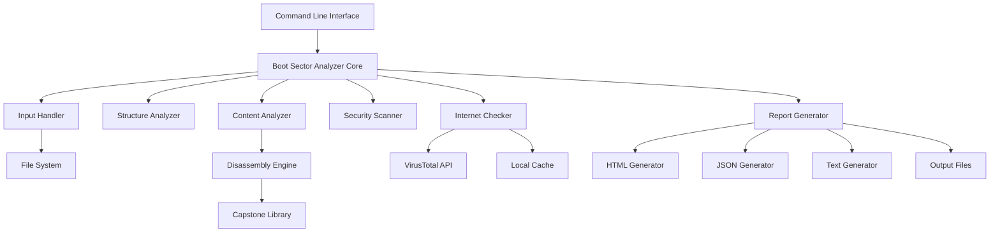

# Design Document: Boot Sector Analyzer v0.2.0

## Overview

The Boot Sector Analyzer is a Python console application that performs comprehensive analysis of boot sectors from disk drives or boot sector image files. The system follows a modular architecture with distinct components for structure analysis, content analysis, security scanning, and threat intelligence gathering.

**Version 0.2.0** represents the enhanced release with complete functionality for boot sector analysis, security threat detection, comprehensive reporting capabilities, advanced hexdump functionality for manual review, boot code disassembly with assembly syntax highlighting, and HTML report generation with interactive elements and responsive design.

The application uses Python's built-in `struct` module for binary parsing, integrates with the VirusTotal API for threat intelligence, includes a disassembly engine for x86/x86-64 boot code analysis, and provides human-readable, JSON, and HTML output formats for analysis results.

## Architecture

The system follows a layered architecture with clear separation of concerns:



### Component Responsibilities

- **CLI Layer**: Argument parsing, user interaction, and output formatting
- **Core Engine**: Orchestrates analysis workflow and coordinates components
- **Input Handler**: Reads boot sectors from devices or image files
- **Structure Analyzer**: Parses MBR structure and validates boot sector format
- **Content Analyzer**: Examines boot code content, calculates hashes, and performs disassembly
- **Disassembly Engine**: Converts boot code machine instructions to assembly language
- **Security Scanner**: Detects known threats and suspicious patterns
- **Internet Checker**: Queries online threat intelligence sources
- **Report Generator**: Creates structured analysis reports in multiple formats (human, JSON, HTML)
- **HTML Generator**: Creates self-contained HTML reports with embedded CSS and syntax highlighting

## Components and Interfaces

### Input Handler

```python
class InputHandler:
    def read_boot_sector(self, source: str) -> bytes:
        """Read 512 bytes from device or file"""
        
    def validate_boot_sector(self, data: bytes) -> bool:
        """Validate boot sector size and basic structure"""
```

**Responsibilities:**
- Read boot sector data from disk devices or image files
- Validate input data size (exactly 512 bytes)
- Handle file I/O errors and permission issues
- Support both raw device access and image file reading

### Structure Analyzer

```python
class StructureAnalyzer:
    def parse_mbr(self, boot_sector: bytes) -> MBRStructure:
        """Parse Master Boot Record structure"""
        
    def validate_boot_signature(self, boot_sector: bytes) -> bool:
        """Check for valid boot signature (0x55AA)"""
        
    def parse_partition_table(self, boot_sector: bytes) -> List[PartitionEntry]:
        """Extract and validate partition table entries"""
        
    def detect_anomalies(self, mbr: MBRStructure) -> List[Anomaly]:
        """Identify structural anomalies"""
```

**Key Features:**
- Uses Python `struct` module for binary parsing
- Parses MBR according to standard 512-byte layout:
  - Bytes 0-445: Bootstrap code area
  - Bytes 446-509: Partition table (4 entries × 16 bytes each)
  - Bytes 510-511: Boot signature (0x55AA)
- Validates partition table consistency
- Detects overlapping partitions and invalid entries

### Content Analyzer

```python
class ContentAnalyzer:
    def calculate_hashes(self, boot_code: bytes) -> Dict[str, str]:
        """Calculate MD5, SHA-256 hashes of boot code"""
        
    def detect_suspicious_patterns(self, boot_code: bytes) -> List[Pattern]:
        """Identify suspicious instruction patterns"""
        
    def extract_strings(self, boot_code: bytes) -> List[str]:
        """Extract readable strings and URLs"""
        
    def analyze_entropy(self, boot_code: bytes) -> float:
        """Calculate entropy to detect encryption/obfuscation"""
        
    def disassemble_boot_code(self, boot_code: bytes) -> DisassemblyResult:
        """Disassemble x86/x86-64 assembly instructions from boot code"""
        
    def identify_boot_patterns(self, instructions: List[Instruction]) -> List[BootPattern]:
        """Identify common boot sector patterns and operations"""
```

**Analysis Techniques:**
- Cryptographic hash calculation (MD5, SHA-256)
- String extraction using regular expressions
- Entropy analysis to detect packed/encrypted code
- Pattern matching for suspicious instruction sequences
- Detection of embedded URLs or IP addresses
- x86/x86-64 disassembly using Capstone engine
- Boot sector pattern recognition (INT 13h, INT 10h, jump instructions)

### Disassembly Engine

```python
class DisassemblyEngine:
    def __init__(self):
        """Initialize Capstone disassembly engine for x86 architecture"""
        
    def disassemble_16bit(self, code: bytes, base_address: int = 0x7C00) -> List[Instruction]:
        """Disassemble 16-bit x86 code (typical for boot sectors)"""
        
    def disassemble_32bit(self, code: bytes, base_address: int = 0x7C00) -> List[Instruction]:
        """Disassemble 32-bit x86 code"""
        
    def format_instruction(self, instruction: Instruction) -> FormattedInstruction:
        """Format instruction with address, bytes, and mnemonic"""
        
    def add_comments(self, instruction: Instruction) -> str:
        """Add explanatory comments for common boot sector operations"""
```

**Disassembly Features:**
- Uses Capstone disassembly framework for accurate x86/x86-64 decoding
- Supports both 16-bit and 32-bit instruction modes
- Handles invalid instructions gracefully by displaying as raw hex
- Provides instruction addresses, opcodes, and mnemonics
- Adds contextual comments for common boot sector operations
- Identifies jump targets and control flow patterns

### Security Scanner

```python
class SecurityScanner:
    def check_known_signatures(self, hashes: Dict[str, str]) -> List[ThreatMatch]:
        """Check hashes against known malware signatures"""
        
    def detect_bootkit_patterns(self, boot_code: bytes) -> List[BootkitIndicator]:
        """Identify common bootkit signatures"""
        
    def assess_threat_level(self, findings: List[Finding]) -> ThreatLevel:
        """Classify overall threat level"""
```

**Detection Capabilities:**
- Known malware hash matching
- Bootkit signature detection
- MBR hijacking indicators
- Suspicious code patterns
- Threat level classification (LOW, MEDIUM, HIGH, CRITICAL)

### Internet Checker

```python
class InternetChecker:
    def query_virustotal(self, file_hash: str) -> VirusTotalResult:
        """Query VirusTotal API for threat intelligence"""
        
    def cache_results(self, hash_value: str, result: dict) -> None:
        """Cache API results locally"""
        
    def handle_rate_limits(self) -> None:
        """Implement API rate limiting"""
```

**Integration Features:**
- VirusTotal API v3 integration using official `vt-py` library
- Local caching to minimize API calls
- Rate limiting compliance
- Graceful degradation when offline
- SSL certificate validation

### Report Generator

```python
class ReportGenerator:
    def generate_report(self, analysis_result: AnalysisResult, format: str) -> str:
        """Generate analysis report in specified format (human, json, html)"""
        
    def generate_hexdump(self, boot_sector: bytes) -> str:
        """Generate hexdump representation of boot sector"""
        
    def format_hexdump_table(self, boot_sector: bytes) -> List[str]:
        """Format hexdump as 17-column table with offset and hex bytes"""
        
    def format_ascii_column(self, data: bytes) -> str:
        """Format ASCII representation with dots for non-printable characters"""
        
    def generate_html_report(self, analysis_result: AnalysisResult) -> str:
        """Generate self-contained HTML report with embedded CSS"""
        
    def format_assembly_html(self, disassembly: DisassemblyResult) -> str:
        """Format disassembled code with syntax highlighting for HTML"""
```

**Hexdump Features:**
- 17-column table format: offset (1 column) + 16 hex bytes (16 columns)
- Zero-padded uppercase hex offsets (0x0000, 0x0010, 0x0020, etc.)
- Hex bytes displayed with proper spacing (e.g., "48 65 6C 6C 6F")
- ASCII representation column showing printable characters
- Non-printable bytes displayed as dots (.) in ASCII column
- Support for human-readable, JSON, and HTML output formats
- Complete 512-byte boot sector coverage (32 rows × 16 bytes)
- MBR section color coding in HTML format

**Report Generation:**
- Structured analysis reports with all findings
- Integration of hexdump section for manual review
- Support for multiple output formats (human-readable, JSON, HTML)
- Critical finding highlighting and threat level indication
- Assembly code disassembly with syntax highlighting
- Interactive HTML elements for enhanced user experience

### HTML Generator

```python
class HTMLGenerator:
    def create_html_document(self, analysis_result: AnalysisResult) -> str:
        """Create complete HTML document with DOCTYPE and metadata"""
        
    def embed_css_styles(self) -> str:
        """Generate embedded CSS for styling and responsive design"""
        
    def format_threat_level_badge(self, threat_level: ThreatLevel) -> str:
        """Create color-coded threat level badge"""
        
    def format_assembly_syntax_highlighting(self, instructions: List[Instruction]) -> str:
        """Apply syntax highlighting to assembly code"""
        
    def create_table_of_contents(self, sections: List[str]) -> str:
        """Generate table of contents with anchor links"""
        
    def format_hexdump_with_colors(self, boot_sector: bytes) -> str:
        """Create color-coded hexdump table for MBR sections"""
```

**HTML Features:**
- Self-contained HTML documents with embedded CSS
- Responsive design for different screen sizes
- Color-coded threat level badges (green/yellow/red/dark red)
- Syntax highlighting for assembly code (blue instructions, green registers, orange values, red addresses)
- Interactive table of contents with anchor navigation
- Monospace formatting for code and hex data
- Professional styling with proper typography
- MBR section highlighting in hexdump display
- Copyable hash values and technical data

## Data Models

### MBR Structure

```python
@dataclass
class MBRStructure:
    bootstrap_code: bytes  # First 446 bytes
    partition_table: List[PartitionEntry]  # 4 entries
    boot_signature: int  # 0x55AA
    disk_signature: Optional[int]  # Optional 4-byte signature at offset 440
    
@dataclass
class PartitionEntry:
    status: int  # Boot indicator (0x80 = bootable, 0x00 = inactive)
    start_chs: Tuple[int, int, int]  # Start CHS address
    partition_type: int  # Partition type code
    end_chs: Tuple[int, int, int]  # End CHS address
    start_lba: int  # Start LBA address
    size_sectors: int  # Size in sectors
```

### Disassembly Models

```python
@dataclass
class DisassemblyResult:
    instructions: List[Instruction]
    total_bytes_disassembled: int
    invalid_instructions: List[InvalidInstruction]
    boot_patterns: List[BootPattern]
    
@dataclass
class Instruction:
    address: int  # Memory address (typically starting at 0x7C00)
    bytes: bytes  # Raw instruction bytes
    mnemonic: str  # Assembly mnemonic (e.g., "mov", "jmp")
    operands: str  # Instruction operands
    comment: Optional[str]  # Explanatory comment for boot sector operations
    
@dataclass
class InvalidInstruction:
    address: int
    bytes: bytes
    reason: str  # Why disassembly failed
    
@dataclass
class BootPattern:
    pattern_type: str  # "disk_read", "interrupt_call", "jump", etc.
    description: str
    instructions: List[Instruction]
    significance: str  # Explanation of what this pattern does
```

### Analysis Results

```python
@dataclass
class AnalysisResult:
    source: str
    timestamp: datetime
    structure_analysis: StructureAnalysis
    content_analysis: ContentAnalysis
    security_analysis: SecurityAnalysis
    threat_intelligence: Optional[ThreatIntelligence]
    hexdump: HexdumpData
    disassembly: Optional[DisassemblyResult]
    
@dataclass
class ContentAnalysis:
    hashes: Dict[str, str]  # MD5, SHA-256 hashes
    entropy: float
    strings: List[str]
    urls: List[str]
    suspicious_patterns: List[Pattern]
    disassembly_result: Optional[DisassemblyResult]
    
@dataclass
class SecurityAnalysis:
    threat_level: ThreatLevel
    detected_threats: List[ThreatMatch]
    suspicious_patterns: List[Pattern]
    anomalies: List[Anomaly]

@dataclass
class HexdumpData:
    raw_data: bytes  # Complete 512-byte boot sector
    formatted_lines: List[str]  # Pre-formatted hexdump lines
    ascii_representation: str  # ASCII view of the data
    total_bytes: int  # Should always be 512 for boot sectors
    
@dataclass
class HTMLReportData:
    title: str
    css_styles: str  # Embedded CSS
    threat_level_badge: str  # HTML for color-coded badge
    table_of_contents: str  # Navigation links
    assembly_highlighted: str  # Syntax-highlighted assembly code
    hexdump_colored: str  # Color-coded hexdump table
```

## Correctness Properties

*A property is a characteristic or behavior that should hold true across all valid executions of a system-essentially, a formal statement about what the system should do. Properties serve as the bridge between human-readable specifications and machine-verifiable correctness guarantees.*

### Converting EARS to Properties

Based on the prework analysis, I'll convert the testable acceptance criteria into universally quantified properties:

**Property 1: Input validation and reading**
*For any* valid input source (device path or image file), the Boot_Sector_Analyzer should read exactly 512 bytes and validate the input data size
**Validates: Requirements 1.1, 1.2, 1.5**

**Property 2: MBR structure parsing completeness**
*For any* valid 512-byte boot sector, the Structure_Analyzer should successfully parse the MBR structure, identify the boot code region (first 446 bytes), and extract all partition table entries
**Validates: Requirements 2.1, 2.3, 2.4**

**Property 3: Boot signature validation**
*For any* boot sector, the Structure_Analyzer should correctly validate the boot signature (0x55AA) and flag missing or incorrect signatures as structural anomalies
**Validates: Requirements 2.2, 2.6**

**Property 4: Partition table consistency validation**
*For any* partition table, the Structure_Analyzer should detect overlapping partitions and validate entry consistency
**Validates: Requirements 2.5**

**Property 5: Hash calculation accuracy**
*For any* boot code, the Content_Analyzer should calculate correct MD5 and SHA-256 cryptographic hashes
**Validates: Requirements 3.1**

**Property 6: Pattern and string detection**
*For any* boot code containing embedded strings, URLs, or suspicious instruction patterns, the Content_Analyzer should successfully identify and extract them
**Validates: Requirements 3.2, 3.3, 3.6**

**Property 7: Partition type validation**
*For any* partition entry, the Content_Analyzer should validate the partition type code against known valid types
**Validates: Requirements 3.4**

**Property 8: Boot code disassembly completeness**
*For any* boot sector, the Content_Analyzer should disassemble the first 446 bytes as x86 assembly instructions, providing instruction addresses, opcodes, and mnemonics for valid instructions
**Validates: Requirements 3.7, 3.8, 11.1, 11.3**

**Property 9: Disassembly error handling**
*For any* boot code containing invalid or unrecognized instructions, the Content_Analyzer should handle them gracefully by displaying them as raw hex data and continuing analysis
**Validates: Requirements 3.9, 11.6**

**Property 10: Multi-mode disassembly support**
*For any* boot code requiring different instruction modes, the Content_Analyzer should handle both 16-bit and 32-bit x86 instruction modes appropriately
**Validates: Requirements 11.2**

**Property 11: Boot pattern recognition**
*For any* boot code containing common boot sector patterns (jump instructions, interrupt calls, disk operations), the Content_Analyzer should identify and highlight these patterns
**Validates: Requirements 11.7**

**Property 12: Assembly instruction commenting**
*For any* disassembled boot code containing common boot sector operations (INT 13h, INT 10h, etc.), the Content_Analyzer should include explanatory comments
**Validates: Requirements 11.9**

**Property 13: Security threat detection**
*For any* boot sector with known malware signatures or bootkit patterns, the Security_Scanner should detect and classify the threat level appropriately
**Validates: Requirements 4.1, 4.2, 4.3**

**Property 14: MBR hijacking detection**
*For any* boot sector with signs of partition table manipulation or rootkit indicators, the Security_Scanner should flag potential MBR hijacking
**Validates: Requirements 4.4, 4.5**

**Property 15: Encryption and obfuscation detection**
*For any* boot sector with encrypted or obfuscated content, the Security_Scanner should detect signs of encryption or obfuscation
**Validates: Requirements 4.6**

**Property 16: Threat intelligence caching**
*For any* threat intelligence query result, the Internet_Checker should cache the result and reuse it for subsequent identical queries
**Validates: Requirements 5.4**

**Property 17: SSL certificate validation**
*For any* HTTPS request made by the Internet_Checker, SSL certificates should be validated to ensure secure connections
**Validates: Requirements 5.6**

**Property 18: Report completeness**
*For any* completed analysis, the Report_Generator should create a structured report containing all structural findings, content analysis results, and security assessment findings
**Validates: Requirements 6.1, 6.2, 6.3, 6.4**

**Property 19: Multi-format report support**
*For any* analysis report, the Report_Generator should support human-readable, JSON, and HTML output formats
**Validates: Requirements 6.5, 7.7**

**Property 20: Critical finding highlighting**
*For any* report containing detected threats, the Report_Generator should highlight critical findings prominently
**Validates: Requirements 6.6**

**Property 21: HTML document structure**
*For any* analysis result formatted as HTML, the Report_Generator should create a complete, self-contained HTML document with DOCTYPE declaration and embedded CSS styling
**Validates: Requirements 6.7, 10.1, 10.2**

**Property 22: HTML color coding**
*For any* HTML report, the Report_Generator should use appropriate color coding for threat levels (green for low, yellow for medium, red for high, dark red for critical) and assembly syntax highlighting (blue for instructions, green for registers, orange for immediate values, red for memory addresses)
**Validates: Requirements 6.8, 10.3, 11.4, 11.5**

**Property 23: HTML interactive elements**
*For any* HTML report, the Report_Generator should include interactive elements such as a table of contents with anchor links for navigation
**Validates: Requirements 6.9, 10.7**

**Property 24: HTML monospace formatting**
*For any* HTML report containing hexdump data, hash values, or assembly code, the Report_Generator should format them using monospace fonts with proper alignment and indentation
**Validates: Requirements 10.4, 10.8, 11.8**

**Property 25: HTML responsive design**
*For any* HTML report, the Report_Generator should include responsive CSS to ensure proper display on different screen sizes
**Validates: Requirements 10.5**

**Property 26: HTML MBR section highlighting**
*For any* HTML report containing hexdump data, the Report_Generator should use background colors to highlight different MBR sections
**Validates: Requirements 10.6**

**Property 27: HTML metadata inclusion**
*For any* HTML report, the Report_Generator should include metadata such as generation timestamp and analyzer version in the HTML header
**Validates: Requirements 10.9**

**Property 28: Command line argument validation**
*For any* set of command line arguments, the Boot_Sector_Analyzer should validate input parameters and display helpful error messages for invalid arguments
**Validates: Requirements 7.2, 7.5**

**Property 29: Output mode support**
*For any* analysis operation, the Boot_Sector_Analyzer should support both verbose and quiet output modes with appropriate detail levels
**Validates: Requirements 7.3, 7.4**

**Property 30: Configuration file support**
*For any* configuration file containing API keys and settings, the Boot_Sector_Analyzer should parse and apply the configuration correctly
**Validates: Requirements 7.6**

**Property 31: Error logging and handling**
*For any* error occurring during analysis, the Boot_Sector_Analyzer should log detailed error information and handle file I/O failures with specific error messages
**Validates: Requirements 9.1, 9.2**

**Property 32: Logging level support**
*For any* logging operation, the Boot_Sector_Analyzer should support configurable logging levels (DEBUG, INFO, WARNING, ERROR) and log all analysis activities
**Validates: Requirements 9.4, 9.6**

**Property 33: Graceful error exit**
*For any* critical error, the Boot_Sector_Analyzer should exit gracefully with appropriate exit codes
**Validates: Requirements 9.5**

**Property 34: Hexdump report inclusion**
*For any* completed analysis, the Report_Generator should include a hexdump section of the complete boot sector in the generated report
**Validates: Requirements 8.1**

**Property 35: Hexdump table format**
*For any* boot sector hexdump, the Report_Generator should format it as a 17-column table with hex offset in the first column and 16 hex bytes in the remaining columns
**Validates: Requirements 8.2, 8.3**

**Property 36: Hexdump ASCII representation**
*For any* boot sector data, the Report_Generator should include ASCII representation alongside hex values, displaying dots (.) for non-printable characters
**Validates: Requirements 8.4, 8.6**

**Property 37: Hexdump offset formatting**
*For any* hexdump offset, the Report_Generator should format it as zero-padded uppercase hexadecimal (e.g., 0x0000, 0x0010)
**Validates: Requirements 8.5**

**Property 38: Hexdump format support**
*For any* analysis report, the Report_Generator should include the hexdump in human-readable, JSON, and HTML output formats
**Validates: Requirements 8.7**

## Error Handling

The system implements comprehensive error handling across all components:

### Input Validation Errors
- Invalid file paths or device access issues
- Incorrect boot sector size (not 512 bytes)
- Permission denied errors for device access
- File not found or corrupted image files

### Parsing Errors
- Malformed MBR structures
- Invalid partition table entries
- Missing or corrupted boot signatures
- Unexpected data formats

### Network Errors
- API connectivity issues
- Rate limit exceeded responses
- SSL certificate validation failures
- Timeout errors during threat intelligence queries

### System Errors
- Insufficient memory for large analyses
- Disk space issues for caching
- Configuration file parsing errors
- Logging system failures

**Error Recovery Strategies:**
- Graceful degradation when network services are unavailable
- Continuation of offline analysis when online services fail
- Detailed error logging for debugging and audit purposes
- User-friendly error messages with actionable guidance

## Testing Strategy

The testing approach combines unit testing and property-based testing to ensure comprehensive coverage:

### Unit Testing
- **Specific Examples**: Test known boot sector samples and expected outputs
- **Edge Cases**: Test boundary conditions like empty files, maximum partition counts
- **Error Conditions**: Test various failure scenarios and error handling paths
- **Integration Points**: Test component interactions and data flow
- **HTML Validation**: Test HTML output structure and CSS embedding
- **Disassembly Accuracy**: Test disassembly against known instruction sequences

### Property-Based Testing
- **Universal Properties**: Verify properties hold across all valid inputs using randomized test data
- **Input Generation**: Create random but valid boot sectors, partition tables, and configuration data
- **Comprehensive Coverage**: Test with minimum 100 iterations per property to catch edge cases
- **Requirements Traceability**: Each property test references its corresponding design property
- **HTML Structure Testing**: Generate random analysis results and verify HTML output validity
- **Disassembly Robustness**: Test disassembly with random byte sequences to ensure graceful handling

**Testing Framework**: Use `pytest` for unit tests and `hypothesis` for property-based testing

**Dependencies for Testing**:
- `capstone` library for disassembly engine testing
- `beautifulsoup4` for HTML structure validation
- `html5lib` for HTML parsing and validation
- Mock VirusTotal API responses for offline testing

**Property Test Configuration**:
- Minimum 100 iterations per property test
- Each property test tagged with: **Feature: boot-sector-analyzer, Property {number}: {property_text}**
- Custom generators for boot sector data, partition tables, malware signatures, and HTML structures
- Shrinking enabled to find minimal failing examples

**Test Data Management**:
- Sample boot sector images for known malware families
- Clean boot sector samples from various operating systems
- Synthetic test data generation for edge cases
- Mock VirusTotal API responses for offline testing
- HTML template validation samples
- Assembly instruction test cases for disassembly validation

**HTML Testing Approach**:
- Validate HTML document structure and DOCTYPE declarations
- Test CSS embedding and self-containment
- Verify color coding for threat levels and syntax highlighting
- Test responsive design CSS rules
- Validate table of contents and anchor link functionality
- Test monospace formatting for technical data

**Disassembly Testing Approach**:
- Test with known x86/x86-64 instruction sequences
- Verify handling of both 16-bit and 32-bit modes
- Test graceful handling of invalid instruction bytes
- Validate instruction address, opcode, and mnemonic extraction
- Test pattern recognition for common boot sector operations
- Verify comment generation for interrupt calls and disk operations

The dual testing approach ensures both specific known cases work correctly (unit tests) and general correctness properties hold across all inputs (property tests), providing comprehensive validation of the boot sector analysis functionality including HTML generation and assembly disassembly.